# Miles

## mMonitor Application

#### Copy database to sd card:

1. Start export using menu overflow (top right 3 dots)
1. display toast when exporting is done

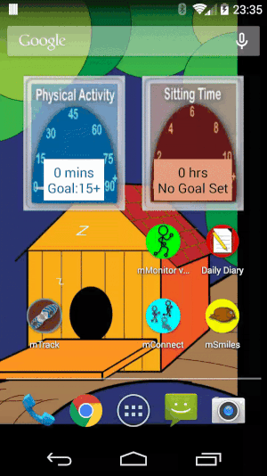

#### Start and stop service

Note:

1. Notifications in the upper left corner.
1. Home button press and return via recently used apps
(preserve the service running state state)

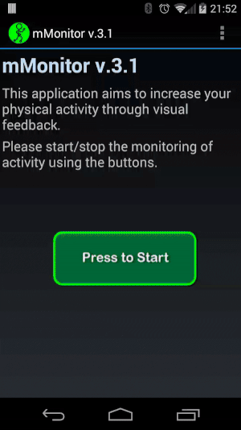

## mConnect Application-Social

### Using menu overflow (top right - three dots)

1. Copy graph data to sd card

    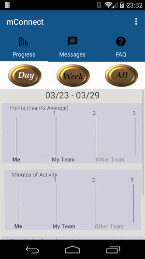
1. Change day

    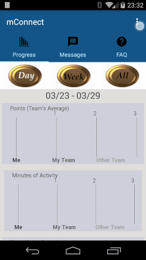
1. Reply to messages

    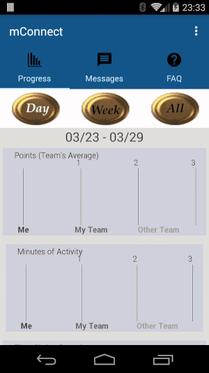
1. Note the changes in menu options as tabs are being switched

    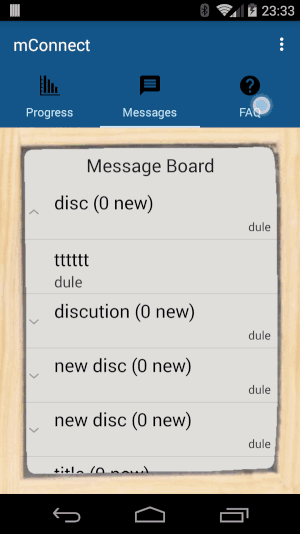

### Using tabs

#### Progress tab

### No data

Note: Try to find some library which does this graph drawing nicer. Current
implementation simply draw lines and rectangles and fill them with simple colors.
It looks kinda too simple. There must be some lib for this. Find it!!

1. Day View

    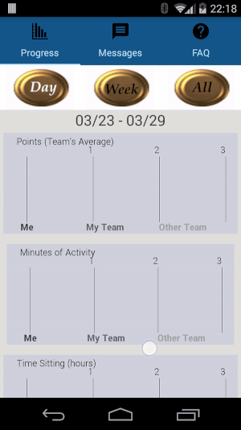
1. Week View

    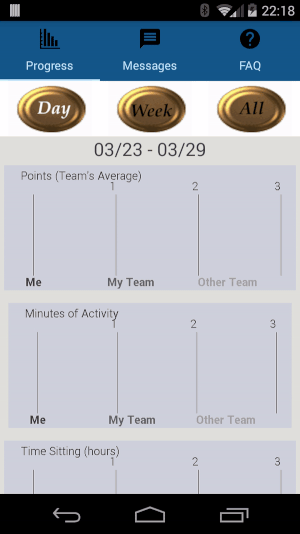
1. All View

    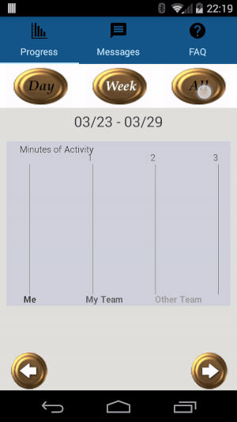

### With Data generated

**Currently verifying if the data displayed is valid/useful**

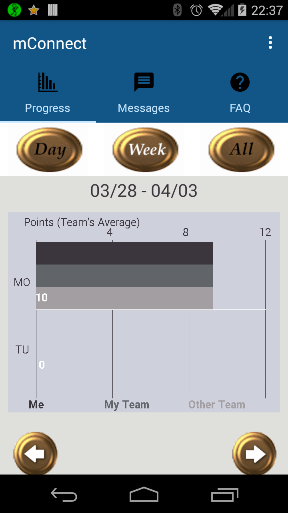

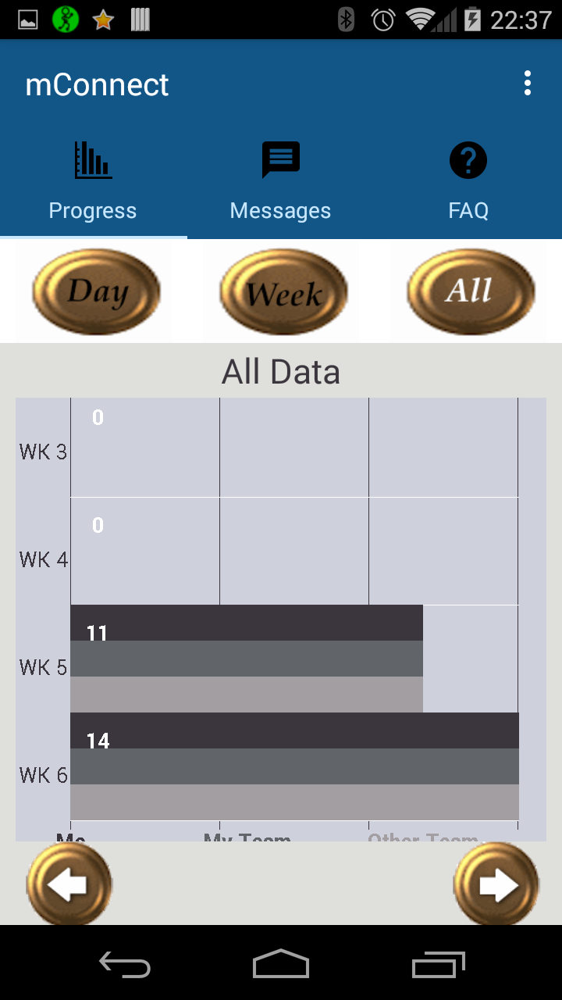

1.

#### Messages tab

1. Message reply functionality (tap on message)
1. Expanding discussion functionality (tap on discussion)
1. Difference between message and discussion is that message have no arrow on left side
    * Is this enough?
    * Do we wanna change this?

    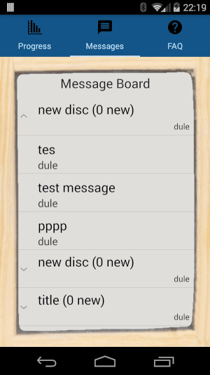

1.
    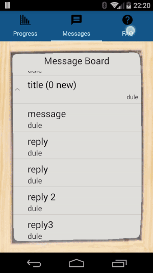

## mTrack Application

## mSmiles Application

* Menu items have same functionality as in other apps. Finish button exits the app.
* Export db export data to sd card.

#### History tab

* Displays levels for every day with image
* Note the scrolling behaviour (swipe left-right)
* Change days can be also done using left right arrows

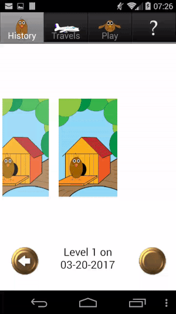

#### Travels tab

After being active, you are visiting cities around the world (no Serbian City - bug :) ).
All of the visiting cities are shown here with the date when you reached it.

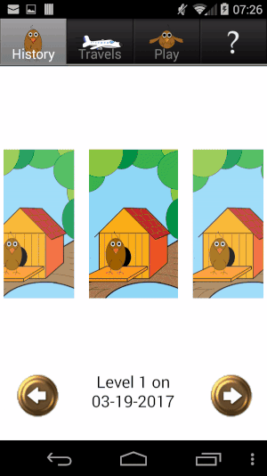

#### Play tab

* Animations.
* Dragging the stick use case (works ok).
* Problem with simple tap on the screen. Bird goes to fetch but stick is falling down.
* **Will work on fixing that after refactoring.**

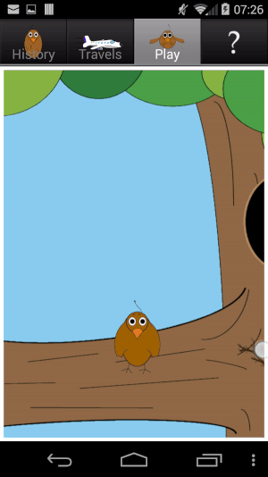

#### FAQ tab

* Button feedback behaviour.
* Workflow
* Animations after arrow clicks.
* Animations after list item click (click with yellow background).

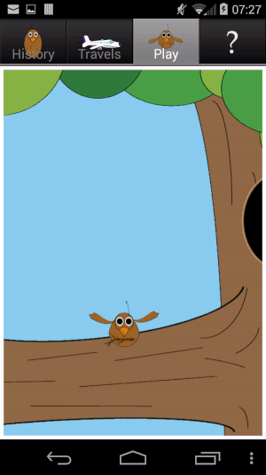