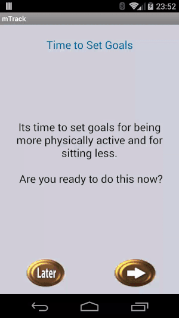

# Miles

In this document we are showing main functions of the Miles applications.
mMonitor App is used for monitoring the user, other apps are used to
present the results to user. We have three different app to present the data gathered:
* mConnect - Social App
* mTrack - Cognitive
* mSmiles - Affect

**No code will be pushed to this repo. This repo is intended only for the purpose
of showing the progress of the Miles applications and should reflect
the current state of the apps.**

## mMonitor Application

#### Copy database to sd card:

1. Start export using menu overflow (top right 3 dots)
1. display toast when exporting is done

#### Start and stop service

Note:

1. Notifications in the upper left corner.
1. Home button press and return via recently used apps
(preserve the service running state state)

## mConnect Application-Social

### Using menu overflow (top right - three dots)

1. Copy graph data to sd card

    
1. Change day

    
1. Create discussion

    
1. Note the changes in menu options as tabs are being switched

    

### Using tabs

#### Progress tab

##### No data

Note: Try to find some library which does this graph drawing nicer. Current
implementation simply draw lines and rectangles and fill them with simple colors.
It looks kinda too simple. There must be some lib for this. Find it!!

1. Day View

    
1. Week View

    
1. All View

    

##### With Data generated

**Currently verifying if the data displayed is valid/useful**

1. With Data displayed

    * Showing content of the tabs with data generated
    * Note the functionality on week page when pressing left, right arrows
    On first tap/swipe (data has changed, probably bug)
    * Functionality when using arrows:
        * Have no idea whats going on, but i see graphs flying around
        * Maybe some date change indicator should be added?
        * Also why only wednesday and tuesday are shown (04/04 is Wed)??
        Is it only today and yesterday data shown

    

1. With Data displayed (change date functionality)

When no data generated, this functionality appears to do nothing. When there is some data
something actually happens on date change:

* Pay attention to data changes and date indicator right above graph. Is it bug or a feature?
* Date is changed only on certain days. Investigate why.. Does it change only for those days
that have data or something else is going on.

    

#### Messages tab

1. Message reply functionality (tap on message)
1. Expanding discussion functionality (tap on discussion)
1. Difference between message and discussion is that message has no arrow on left side
    * Is this enough?
    * Do we wanna change this to make them more distinguishable?

    

1.
    

## mTrack Application

### Progress tab

1. Week page
    * Changing week functionality works weird (i have to scrooll to see it)
    * Maybe add auto scroll or redesign page
2. All Page
    * Black color actual, blue color goals
    * All page - data makes sense (maybe redesign)

### Tips tab

* No swiping to see animations
* Animating views on every item click
* Arrows click, buttons click, list items click all start some animation
    * dont break them while refactoring
    * use this as regression test (maybe make ui tet with espresso for this,
    set the stable ids first)

### FAQ tab

Same as for mConnect

### Setting Goals

#### Later Chosen

What happens when later is chosen:

* You get straigh into the app without goals set
* Next when you enter the app you get asced for goals again
* Its a bug that you cant set goals through menu even though you chosen "later" before.
* You should be allowed to enter goals in this case.
* If You set goals and then try to reset them as soon as you get in the app, thats not allowed,
 you should wait for app to prompt you for goals (next week).

#### Proceed with goals setting

This step should be shown to user once a week to reset goals.

### Menu Options

## mSmiles Application

* Menu items have same functionality as in other apps. Finish button exits the app.
* Export db export data to sd card.

#### History tab

* Displays levels for every day with image
* Note the scrolling behaviour (swipe left-right)
* Change days can be also done using left right arrows

#### Travels tab

After being active, you are visiting cities around the world (no Serbian City - bug :) ).
All of the visiting cities are shown here with the date when you reached it.

#### Play tab

* Animations.
* Dragging the stick use case (works ok).
* Problem with simple tap on the screen. Bird goes to fetch but stick is falling down.
* **Will work on fixing that after refactoring.**

#### FAQ tab

* Button feedback behaviour.
* Workflow
* Animations after arrow clicks.
* Animations after list item click (click with yellow background).

